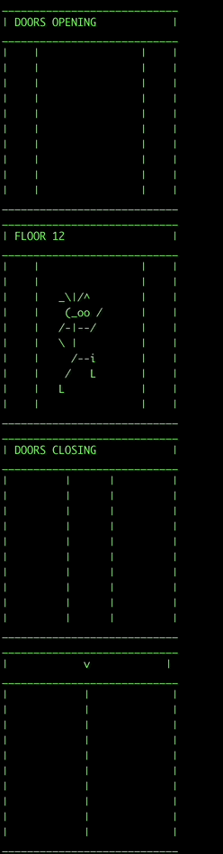

# Alyssa Feagans 7/6/2023 - Outside Analytics Elevator Problem

## Python solution
    Input is an integer array with the first value being the starting floor
    Returns a string in format = "TOTAL_TRAVEL_TIME FLOOR_VISITED1, FLOOR_VISITED2, FLOOR_VISITED3"

    If running from command line, prints results to stdout:
        Total travel time: travel_time
        Floors visited in order = floors_visited

    Script ignores duplicate floors back to back (can only visit a floor once without leaving)
    Assumes elevator has "infinite" positive and negative floors and there are no gaps in numbers in the elevator.
    Infinite being restricted to the available memory on the system being used to run.

    Dependencies: python >= 3.0
    Best Case & Worst Case Runtime: O(n) where n is length of input array (num of floors to visit)

    To run python script from python:
    elevator([12, 2, 9, 1, 32])

    To run python script with command line inputs: 
    (Enter list of floors separated by spaces with no commas or special characters
    $ python3 python/elevator.py 12 2 9 1 32

    TESTS:
    Dependencies to run tests: Python 3.7+ or PyPy3

    Install pytest:
    $ pip install -U pytest

    Validate install: 
    $ pytest --version

    To run all tests:
    $ pytest python/test_elevator.py

    To get more info on a test:     
    $ pytest python/test_elevator.py -vv

## Python Animation solution
    Best Case Runtime: O(n + m)
    n is length of input array (num of floors to visit)
    m is the max difference between two consecutive floors to visit

    EX: Input array = [4, 0, 20, 0]
    Outer loop will execute n=4 times. 
    The inner loop will execute a different number of times for each floor difference. The max floor diff = 20.
    For this example, the max floor difference (m) will drive the runtime since it is the larger value.

    EX: Input array = [4, 1, 0, 2, 0, 1, -1, 0]
    Outer loop will execute n=8 times. 
    The inner loop will execute a different number of times for each floor difference. The max floor diff = 3.
    For this example, the length of the input array (n) will drive the runtime since it is the larger value.

    Worst Case Runtime: O(n * m)
    n is length of input array (num of floors to visit)
    m is the max difference between two consecutive floors to visit

    EX: Input array = [999, 0, 999, 0]
    Outer loop will execute n=4 times. 
    Each of those times, the inner loop will execute m=999 times since the difference of each floor to visit is the same.

    To run python script with command line inputs: 
    (Enter list of floors separated by spaces with no commas or special characters
    $ python3 python/elevator_animation.py 12 2 9 1 32

    Outputs elevator animation showing what floors we are visiting and opening doors at and showing direction of elevator at each floor traveled through.
    Prints results to stdout:
        Total travel time: travel_time
        Floors visited in order = floors_visited

## Bash Script solution
    Input is an integer array with the first value being the starting floor
    Prints results to stdout:
        Total travel time: travel_time
        Floors visited in order = floors_visited

    Script ignores duplicate floors back to back (can only visit a floor once without leaving)
    Assumes elevator has "infinite" positive and negative floors and there are no gaps in numbers in the elevator.
    Infinite being restricted to the available memory on the system being used to run.

    Best Case & Worst Case Runtime: O(n) where n is length of input array (num of floors to visit)

    Make file executable:
    $ chmod +x bash/elevator.sh

    Run bash script:
    If running on Windows, need WSL / Git Bash or another Bash shell for Windows. 
    ./bash/elevator.sh

    Running bash script will run all tests in elevator.sh

### TODOS:
- ~~Python - return output instead of printing~~
- ~~Python - allow user to input example through command line~~
- ~~Python - create animation for elevator in terminal~~
- ~~Write tests for python solution~~
- ~~Write a solution as a bash script~~
- ~~Test in parallels on windows machine~~